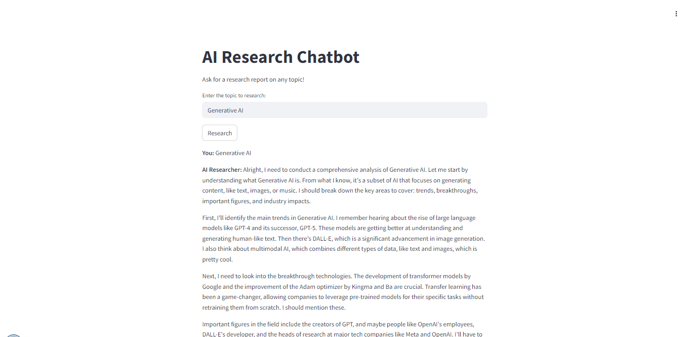

# AI-Research-Agent-with-Clarifai-and-CrewAI
A specialized Research AI agent powered by a Clarifai

## Overview

AI-Research-Agent-with-Clarifai-and-CrewAI is a specialized research assistant that leverages the power of Clarifai's AI platform and CrewAI's orchestration capabilities. This project is designed to automate and enhance research workflows by integrating advanced AI models for data analysis, information extraction, and intelligent task management.

## Features

- **Clarifai Integration:** Utilize Clarifai's state-of-the-art AI models for image, text, and data analysis.
- **CrewAI Orchestration:** Seamlessly manage and automate research tasks using CrewAI's agent-based framework.
- **Customizable Workflows:** Adapt the agent to various research domains and requirements.
- **Scalable Architecture:** Easily extend and deploy the agent for individual or team-based research projects.

## Getting Started

### Prerequisites

- Python 3.8+
- Clarifai API Key
- CrewAI API Key

### Installation

1. **Clone this repository**
   ```bash
   git clone https://github.com/sharsha315/AI-Research-Agent-with-Clarifai-and-CrewAI.git
   cd AI-Research-Agent-with-Clarifai-and-CrewAI
   ```

2. **Create a virtual environment (optional but recommended)**
    ```bash
    python -m venv venv
    source venv/bin/activate  # On Windows: venv\Scripts\activate
    ```

3. **Install dependencies**
    ```bash
    pip install -r requirements.txt
    ```

### Configuration

- Create a `.env` file in the project root:
    ```
    CLARIFAI_PAT=your_clarifai_api_key
    ```

### Usage

Run the agent with:

```bash
streamlit run main.py
```

Follow the prompts to input your research query and let the agent handle the rest.

## Example Use Cases

- Academic literature review automation
- Market research and trend analysis
- Data extraction from unstructured sources

## Demo Snapshot


## Contributing

Contributions are welcome! Please open issues or submit pull requests for improvements and new features.

## License

This project is licensed under the MIT License. See [LICENSE](LICENSE) for details.

## Acknowledgements

- [Clarifai](https://www.clarifai.com/)
- [CrewAI](https://crewai.com/)